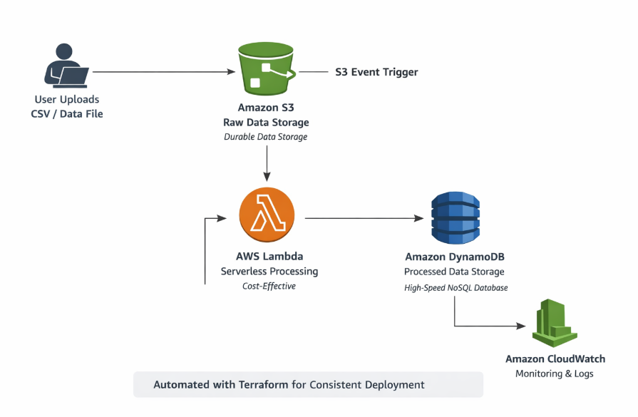

# Event Driven Reporting System

## Project Overview
This project implements an event-driven data processing and automated reporting system using AWS cloud services and DevOps automation tools.

The goal of this system is to automatically provision infrastructure, process incoming data events, and generate reports with minimal manual intervention.

---

## Architecture

The system follows an event-driven architecture where data events trigger automated workflows.
AWS services are provisioned using Terraform, and automation is handled through GitHub Actions.

When an event such as a data upload occurs, an AWS Lambda function processes the data and stores results in DynamoDB.
This design ensures scalability, reliability, and fault tolerance.

---

## Technologies Used
- AWS (S3, Lambda, DynamoDB)
- Terraform (Infrastructure as Code)
- GitHub Actions (CI/CD Automation)
- Python (Data Processing)
- YAML (Pipeline Configuration)

---

## Automation Flow
1. Code is pushed to the GitHub repository.
2. GitHub Actions pipeline is triggered automatically.
3. Terraform provisions AWS infrastructure.
4. S3 events trigger Lambda functions.
5. Processed data is stored and used to generate reports.

---

## Fault Tolerance and Scalability
- AWS managed services provide built-in scalability and high availability.
- Event-driven design reduces system downtime.
- Infrastructure as Code ensures consistent and repeatable deployments.

---

## Documentation
- Research and architecture documents are available in the `docs` folder.
- Architecture diagrams are available in the `architecture` folder.

---

## Conclusion
This project demonstrates a cloud-native, event-driven reporting system using automated infrastructure and data processing pipelines.
